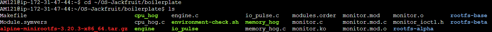
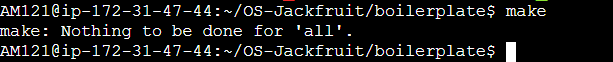
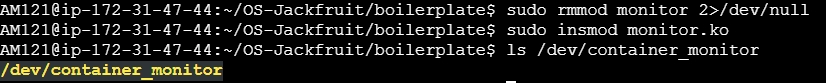
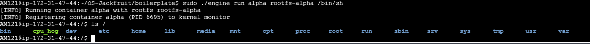
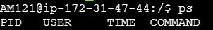
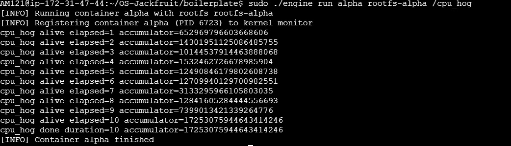
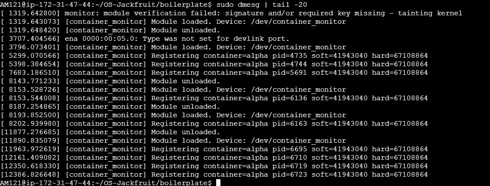

# OS Jackfruit — Lightweight Container Runtime

## Overview
This project implements a lightweight container runtime in C with kernel-level monitoring. It demonstrates core operating system concepts such as process creation, isolation, system calls, and user-kernel communication.

---

## Features
- Process isolation using `clone()`
- Filesystem isolation using `chroot()`
- Program execution using `exec()`
- Kernel monitoring using a loadable kernel module
- Communication between user space and kernel using `ioctl`
- Custom device file: `/dev/container_monitor`

---

## Architecture

- **engine.c** → User-space container runtime
- **monitor.c** → Kernel module
- **monitor_ioctl.h** → Shared interface (ioctl)
- **rootfs-alpha/** → Container filesystem

---

## Execution Flow

1. User runs container using CLI  
2. `clone()` creates isolated process (PID namespace)  
3. `chroot()` isolates filesystem  
4. `exec()` runs workload inside container  
5. PID is sent to kernel module using `ioctl`  
6. Kernel logs monitoring data  

---

## Test Cases

See [TEST_CASES.md](./TEST_CASES.md)

---

## Demonstration

### Steps:

cd ~/OS-Jackfruit/boilerplate
make
sudo rmmod monitor 2>/dev/null
sudo insmod monitor.ko
ls /dev/container_monitor
sudo ./engine run alpha rootfs-alpha /cpu_hog
sudo dmesg | tail -20

---

## Screenshots

### 1. Project Structure

### 2. Build Output

### 3. Kernel Module Loaded

### 4. Container Shell

### 5. PID Isolation

### 6. CPU Execution

### 7. Kernel Logs (Most Important)

---

## Key Concepts from Syllabus

### Unit 1: Process Management
- Process creation using `clone()`
- Execution using `exec()`
- OS structure (user space vs kernel space)

### Unit 2: IPC
- Communication using `ioctl`
- Interaction via device file `/dev/container_monitor`

### Unit 3: Memory Management
- Soft and hard memory limits (conceptual monitoring)

### Unit 4: File System
- Filesystem isolation using `chroot()`
- Directory structure within container

---

## Sample Output

[INFO] Running container alpha with rootfs rootfs-alpha
[INFO] Registering container alpha (PID XXXX) to kernel monitor
cpu_hog alive elapsed=...
[INFO] Container alpha finished

Kernel log:

[container_monitor] Registering container-alpha pid=XXXX soft=41943040 hard=67108864

---

## Conclusion

This project successfully demonstrates a simplified container runtime with kernel-level monitoring. It applies fundamental operating system concepts such as process isolation, system calls, and kernel interaction.

---

## Author
SRN: AM121,AM072
